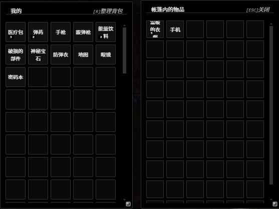
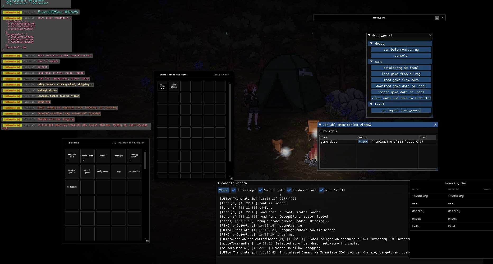
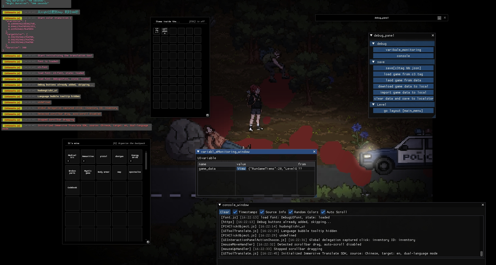

# Pixel Doomsday Survival Game

A pixel-art survival game built with Construct 3, featuring doomsday/post-apocalyptic themes with a focus on atmospheric storytelling and survival mechanics.

## Tech Stack & Architecture

### Game Engine & Development Environment
- **Construct 3**: The core game engine powering this project
- **TypeScript**: Used for extending Construct 3's functionality with custom scripting

### Custom Framework
This game uses a custom TypeScript-based framework called `pmlsdk$ProceduralStorytellingSandboxRPGDevelopmentToolkit` that provides:
- Game state management
- Event handling system
- Utility functions for game development
- Runtime integration with Construct 3

### Key Modules

#### Character System
- Character controller with WASD movement
- Animation system for breathing and movement
- Character audio for footsteps and interactions

#### Environment
- Weather system with rain effects
- Ambient lighting system for day/night cycles
- Y-sorting for depth management of game objects

#### Interaction System
- Clickable object system for environmental interactions
- Interactive UI panels for player choices
- Dialogue system with subtitles


#### UI Framework
- Custom UI system built with imgui for debugging
- Window management system
- Inventory interface
- Dialogue and subtitle system
- Screen effects for visual feedback



### Window Library System (UIWindowLib)

The game includes a comprehensive window library that provides a unified approach to creating custom UI windows with consistent appearance and behavior.




#### Core Features

- **Customizable Windows**: Create windows with configurable size, position, and opacity
- **Drag & Drop Support**: All windows can be freely moved by dragging the title bar
- **Resizable Interface**: Windows can be resized using the bottom-right corner handle
- **Minimization**: Windows can be minimized to show only the title bar
- **Z-Order Management**: Windows automatically stack with the most recently used on top
- **Animation Effects**: Smooth opening/closing animations with scaling and fade effects
- **Event Handling**: Optimized event system ensures proper interaction within windows
- **Global Style System**: Consistent styling across all UI windows

#### Basic Usage

```typescript
// Create a basic window
const { windowElement, contentElement, close } = UIWindowLib.createWindow(
    "Inventory",  // Window title
    500,          // Width (px)
    400,          // Height (px)
    0.95          // Opacity (0-1)
);

// Add content to window
contentElement.innerHTML = `
    <div class="inventory-container">
        <!-- Window content goes here -->
    </div>
`;

// Close window programmatically when needed
close();
```

#### Advanced Management

The window system can be extended with a manager class that provides:

- Type-based window creation and tracking
- Consistent positioning and styling across window types
- Hotkey integration for toggling windows
- Window state management (open/closed status)
- Global operations (close all, minimize all)

This creates a unified and professional user interface system that maintains consistent styling while allowing for specialized window content and behavior.

### Game Features
- Pixel art visual style
- Character movement and interaction
- Environmental storytelling
- Dynamic weather effects
- Inventory system
- Dialogue system

## Debugging Tools

The game includes several advanced debugging tools built with custom ImGui implementation:


### Dual Console System

The game implements two complementary console systems, each with different purposes and capabilities:

#### 1. ImGui-Based Floating Console
- **Activation**: Press the backtick key (n) to toggle
- **Implementation**: Built with ImGui rendering directly in the game canvas
- **Key Features**:
  - Freely positionable and resizable window
  - Full mouse interaction support
  - Copyable text with right-click
  - Command input support
  - Log filtering options
  - Transparency control
  - Maintains state between scene transitions
  - Advanced stack tracing for accurate source attribution


#### 2. HTML/CSS Fixed Console
- **Activation**: Always visible (toggleable via debug panel)
- **Implementation**: DOM-based overlay using HTML elements
- **Key Features**:
  - Fixed at top or bottom of screen
  - Non-interactive display (doesn't capture mouse events)
  - Lightweight resource usage
  - Color-coded message categories
  - Source file attribution
  - Position toggleable (top/bottom)
  - Multiple display modes
  - Customizable opacity settings

#### Console Implementation Comparison

| Feature | ImGui Console | HTML/CSS Console |
|---------|--------------|-----------------|
| Positioning | Freely movable | Fixed to screen edge |
| Interaction | Full mouse support | Display only (non-interactive) |
| Resource usage | Higher (renders to canvas) | Lower (uses DOM elements) |
| Message filtering | Yes (via UI controls) | No (displays all) |
| Command input | Yes | No |
| Copy support | Yes | No |
| Persistence | Retains logs between scenes | Clears on scene change |
| Integration | Part of ImGui debug toolkit | Part of HTML UI layer |
| Use case | Deep debugging and command input | Passive monitoring and quick feedback |

#### Code Example - Using Both Console Systems:

```typescript
// Log to both console systems simultaneously
console.log("Player position:", player.position);

// ImGui console specific features
UIConsole.Clear();  // Clear ImGui console only
UIConsole.SetShowTimestamps(true);

// HTML console specific features
UIDebug.SetConsolePosition('top');  // Move HTML console to top
UIDebug.SetConsoleAlwaysShow(false);  // Hide HTML console
```

#### When to Use Each Console

- **ImGui Console**: For interactive debugging, entering commands, and complex log analysis
- **HTML Console**: For quick visual feedback, passive monitoring, and non-intrusive display

Both consoles automatically intercept standard `console.log`, `console.warn`, and `console.error` calls, making them fully compatible with existing code.

### Debug Mode System

The game includes a centralized debug mode management system that allows developers to quickly enable or disable all debugging tools at once.

#### Core Features

- **One-Click Debug Toggle**: Enable or disable all debugging tools with a single flag
- **Sequential Tool Activation**: Ensures debugging tools initialize in the correct order
- **Runtime Toggle Support**: Can be enabled/disabled during gameplay
- **Automatic Initialization**: Activates debugging tools on game startup (when enabled)

#### Implementation Details

The debug mode system is implemented in `PIXDebugMode.ts` and manages the following debug components:
- Variable monitoring
- Debug button panel
- ImGui console

```typescript
// Debug mode manager class
export class dEBUG_MOD {
    static isEnable = true;  // Master switch for debug mode
    static isRunMod = false; // Flag to prevent multiple initializations
    
    // Asynchronously activates all debug tools in sequence
    static async asynload() {
        if (dEBUG_MOD.isRunMod) return
        if (dEBUG_MOD.isEnable) {
            // Activate debugging tools in sequence with delay
            VariableMonitoring.Toggle();
            IMGUIDebugButton.Toggle();
            await pmlsdk$ProceduralStorytellingSandboxRPGDevelopmentToolkit.WAIT_TIME_FORM_PROMISE(1)
            UIConsole.Toggle();
            
            dEBUG_MOD.isRunMod = true;
        }
    }
}
```

#### Usage Examples

**Enable/Disable Debug Mode Before Game Start:**
```typescript
// In PIXDebugMode.ts
dEBUG_MOD.isEnable = true;  // Enable debug mode
// or
dEBUG_MOD.isEnable = false; // Disable debug mode
```

**Toggle Debug Mode During Runtime:**
```typescript
// Disable all debugging tools
dEBUG_MOD.isEnable = false;

// Re-enable all debugging tools
dEBUG_MOD.isEnable = true;
dEBUG_MOD.isRunMod = false; // Reset the run flag
dEBUG_MOD.asynload();       // Re-initialize tools
```

**Creating a Debug Toggle Button:**
```typescript
// Add a debug mode toggle button to the debug panel
IMGUIDebugButton.AddButton("Toggle Debug Mode", () => {
    dEBUG_MOD.isEnable = !dEBUG_MOD.isEnable;
    if (dEBUG_MOD.isEnable && !dEBUG_MOD.isRunMod) {
        dEBUG_MOD.asynload();
    }
});
```

The debug mode system provides a clean and centralized way to manage all debugging tools, allowing developers to quickly switch between development and testing environments without modifying multiple parts of the codebase.

### Variable Monitoring
A real-time variable monitoring system for tracking game state.


- **Activation**: Press 'n' to toggle the variable monitoring panel
- **Features**:
  - Real-time display of registered variables
  - Expandable object properties
  - Value type identification
  - Source file tracking
  - Detail view for complex objects
  - Categorized variable organization

**Usage Examples:**
```typescript
// Add a value to monitor
VariableMonitoring.AddValue("playerPosition", player.position, "Player");

// Remove a monitored value
VariableMonitoring.RemoveValue("playerPosition");

// Clear all monitored values
VariableMonitoring.ClearAll();
```

### Debug Button Panel
A customizable panel of debug buttons for triggering in-game actions and tests.

- **Activation**: Press 'm' to toggle the debug button panel
- **Features**:
  - Categorized button organization
  - Color-coded buttons
  - Tooltip support
  - Nested category structure
  - Collapsible categories

**Usage Examples:**
```typescript
// Add a basic button
IMGUIDebugButton.AddButton("Spawn Enemy", () => {
    // Spawn enemy code here
});

// Add a category
const categoryId = IMGUIDebugButton.AddCategory("Weather");

// Add a button to a category
IMGUIDebugButton.AddButtonToCategory(categoryId, "Toggle Rain", () => {
    // Toggle rain code
});

// Add a color-coded button
IMGUIDebugButton.AddColorButton("Emergency Reset", [1.0, 0.0, 0.0, 1.0], () => {
    // Reset code
});
```

### Comprehensive Debug UI
A main debug interface that combines various debugging tools:

- **Features**:
  - Variable monitoring with reference tracking
  - Dynamic value updates
  - Expandable object inspection
  - Console output capture
  - Custom font support
  - Draggable windows
  - Customizable appearance

**Usage Examples:**
```typescript
// Initialize debug UI with toggle key
DEBUG.DebugMainUI = UIDebug.InitDebugPanel('m');

// Add a variable to monitor
DEBUG.DebugMainUI.AddValue(someVariable);

// Track a variable by reference (updates automatically)
DEBUG.DebugMainUI.AddValueByReference(() => player.health, 'Player Health');

// Add a debug button
DEBUG.DebugMainUI.DebuPanelAddButton("Test Function", () => {
    // Test code here
});
```

## Interactive Object System

The game features a powerful string-based interaction system that enables players to interact with environmental objects through a dynamic, context-sensitive interface.

### Core Features

- **String-Parsed Interaction Definitions**: Define possible interactions with a simple comma-separated string format
- **Dynamic Interaction Panel**: Context-sensitive UI panel that appears when interacting with objects
- **Distance-Based Interaction**: Automatic range checking for realistic interaction constraints
- **Visual Feedback**: Object highlighting on hover with outline effects
- **Event-Driven Architecture**: Clean separation between interaction definition and handlers
- **Automatic UI Closing**: UI closes when player moves away from interaction range
- **Integration with Dialogue & Inventory**: Seamless connection to other game systems

### How It Works

The interactive object system uses a simple yet powerful string-based definition format. Each interactive object stores its available actions as a comma-separated string, which is parsed at runtime to generate interaction options.

#### Object Definition Structure

Interactive objects have these key properties:
- **ID**: Unique identifier for the object
- **ObjectName**: Display name shown in the interaction UI
- **Actions**: Comma-separated string of available interactions

When a player clicks on an interactive object:
1. The system checks if the player is within interaction range
2. The object's action string is parsed into individual options
3. An interaction panel appears showing available actions
4. The player can select an action, triggering the associated event

### Code Example - Defining Interactive Objects

In Construct 3, create an object with these instance variables:

```typescript
// Interactive object instance variables
{
    ID: "ZhangPeng",           // Unique object identifier
    ObjectName: "Tent",        // Friendly name
    Actions: "inventory,find"  // Available actions as comma-separated string
}
```

### String-Based Action Parsing

The action string can be a simple list or use a special format for enhanced functionality:

```typescript
// Simple comma-separated list
"open,close,examine,use"

// With custom IDs (Format: ActionName{ActionID})
"Search{find},Open Inventory{inventory},Take{pickup}"
```

The parser extracts both display names and functional IDs, allowing for friendly action names while maintaining consistent event handling.

### Interaction Panel

The interaction panel displays all available actions from the parsed string in a table format showing:
- Action Name
- Action ID (for debugging)
- Source (object that provides the action)

The panel is automatically positioned in the bottom-right corner of the screen and resizes based on content.

### Code Example - Interaction Event Handling

```typescript
// Listen for interaction button clicks
pmlsdk$ProceduralStorytellingSandboxRPGDevelopmentToolkit.gl$_ubu_init(() => {
    pmlsdk$ProceduralStorytellingSandboxRPGDevelopmentToolkit.gl$_call_eventhandle_(
        "ChoosePanleButtonClick:ClickButton", 
        (e: any) => {
            // Get clicked button ID
            const buttonId = e.data.ButtonContent_;
            
            // Get the last clicked object
            if (LastestChooseObject == null) return;
            
            // Handle different actions based on object type and button ID
            if (LastestChooseObject.instVars.ID == "ZhangPeng") {
                if (buttonId == "inventory") {
                    // Open inventory for this object
                    openObjectInventory(LastestChooseObject);
                } 
                else if (buttonId == "find") {
                    // Start dialogue for this object
                    DialogueMainController.ShowDialogue(DIA_CONTENT_ZHANGPENG_01);
                }
            }
        }
    );
});

// Helper function to open object inventory
function openObjectInventory(interactiveObject) {
    // Ensure object has inventory data
    if (!interactiveObject.instVars.InventoryData) {
        interactiveObject.instVars.InventoryData = "[]";
    }
    
    // Parse inventory data
    const inventoryData = DeserializeItemsOnly(
        interactiveObject.instVars.InventoryData
    );
    
    // Create update callback to synchronize changes
    const updateInfo = {
        instance: interactiveObject,
        varName: "InventoryData"
    };
    
    // Show inventory UI
    inventoryManager.ShowOtherInventory(
        inventoryData, 
        4, 6, 
        updateInfo, 
        interactiveObject.instVars.InventoryName
    );
}
```

### Visual Highlighting System

The system includes automatic visual feedback for interactive objects:

```typescript
// Enable outline effect when mouse hovers over an object
static EnableOutLine(object: InstanceType.ClickObjectEntity, ifEnable: boolean) {
    object.effects[0].isActive = ifEnable;
}

// Add event handlers for mouse interactions
pmlsdk$ProceduralStorytellingSandboxRPGDevelopmentToolkit.gl$_call_eventhandle_(
    "ClickObject:MouseOverObject", 
    (e: any) => {
        var GetChooseObject = e.data.object;
        ClickObject.EnableOutLine(GetChooseObject, true);
        document.documentElement.style.cursor = "pointer";
    }
);
```

### Distance-Based Interaction

The system automatically enforces a maximum interaction distance:

```typescript
// Define maximum interaction distance
static ClickObjectClickMaxDistance = 200;

// Check distance during interaction
var DistanceFromObject = pmlsdk$ProceduralStorytellingSandboxRPGDevelopmentToolkit.CalculateDistancehahaShitCode(
    interactiveObject.x,
    interactiveObject.y,
    player.x,
    player.y
);

if (DistanceFromObject > ClickObject.ClickObjectClickMaxDistance) {
    UISubtitleMain.ShowSubtitles("Too far to interact!", 2);
    return;
}
```

### Integration with Game Systems

The interaction system seamlessly connects to other game systems:

```typescript
// Example: Connecting interaction to dialogue system
if (buttonId == "find") {
    // Start a dialogue sequence
    DialogueMainController.ShowDialogue(`
        左-> The tent looks abandoned
        右->choose:Look closer
            左-> You notice signs of a hasty departure
        右->choose:Check for supplies
            左-> [code-(openInventoryFunction())]
    `);
}

// Example: Connecting interaction to inventory system
if (buttonId == "inventory") {
    // Open object's inventory
    const items = DeserializeItemsOnly(object.instVars.InventoryData);
    inventoryManager.ShowOtherInventory(items, 3, 5, {
        instance: object,
        varName: "InventoryData"
    }, "Abandoned Tent");
}
```

This interaction system provides a flexible foundation for environmental storytelling, allowing designers to create rich, interactive game worlds with minimal code duplication.

## Dialogue System

The game features a sophisticated dialogue system that enables rich narrative experiences with branching conversations, choices, and scriptable events.

### Core Features

- **Typewriter Text Effect**: Text appears letter by letter for a cinematic feel
- **Dialogue Positioning**: Support for left and right-aligned dialogue to distinguish speakers
- **Character Attribution**: Dialogue can be attributed to specific characters
- **Branching Choices**: Player can select from multiple dialogue options
- **Nested Conversations**: Support for multi-level dialogue trees
- **Code Execution**: Run custom code from dialogue via special tags
- **Draggable Interface**: Dialogue window can be repositioned and resized
- **Keyboard Shortcuts**: Space to skip typewriter effect, click or key to advance

### Dialogue Script Format

The dialogue system uses a simple but powerful scripting format:

```
position->text content
position->choose:choice text
    position->response text for this choice
    position->another response line
position->continue
```

Where:
- `position`: Can be `left` or `right` to determine text alignment
- `text content`: The actual dialogue text to display
- `choose:choice text`: Defines a choice the player can select
- Indented lines after a choice are displayed when that choice is selected
- `continue`: Signals the end of a choice branch, returning to main dialogue flow

### Code Execution in Dialogue

You can trigger custom TypeScript functions from dialogue using the `[code-(function_call())]` syntax:

```
left->Should we proceed? [code-(triggerEvent('door_open'))]
```

### Example Dialogue Script

```
左->篝火余烬中飘起一缕青烟
右->（蹲下捻动炭灰）这堆火最多半小时前还有人...
左->choose:拨开灰烬检查
    右->（金属反光）烧烤架底下压着半块没烧完的薯片包装
    左->包装袋边缘沾着暗红色痕迹
右->（用树枝挑起）番茄酱？还是...血迹？
左->continue
左->北面斜坡传来乌鸦刺耳的叫声
```

### Usage in Code

To display a dialogue in game:

```typescript
// Define dialogue content
const dialogueContent = `
左->你好，旅行者。
右->你是谁？为什么在这里？
左->choose:友好回应
    右->我是向导，来帮助你的。
左->choose:警惕询问
    右->这不重要，你需要离开这里。
`;

// Show the dialogue
DialogueMainController.ShowDialogue(dialogueContent);
```

To handle dialogue flow between different scripts:

```typescript
async function switchToNextDialogue() {
    // Close current dialogue
    DialogueMainController.CloseDialogue();
    
    // Wait for animation to complete
    await pmlsdk$ProceduralStorytellingSandboxRPGDevelopmentToolkit.WAIT_TIME_FORM_PROMISE(0.5);
    
    // Show next dialogue
    DialogueMainController.ShowDialogue(NEXT_DIALOGUE_CONTENT);
}
```

### Integration with Game Events

The dialogue system integrates with the game's event system to trigger gameplay changes:

- Opening/closing inventory
- Starting/ending cutscenes
- Modifying character states
- Updating quest progress
- Triggering environmental changes

This creates a seamless connection between narrative and gameplay mechanics.

## Inventory System

The game features a robust and flexible inventory system with support for multiple inventory types, item management, and intuitive drag-and-drop interactions.

### Core Features

- **Dual Inventory Structure**: Main player inventory and temporary/contextual "other" inventories
- **Item Quality Tiers**: Support for item rarity/quality classification (S, A+, A, B, C, D, E, etc.)
- **Drag and Drop Interface**: Intuitive item movement between inventories
- **Serialization**: Support for saving/loading inventory states
- **Grid and Oneline Modes**: Multiple display modes for different contexts
- **Automatic Item Stacking**: Similar items automatically stack together
- **Item Tooltips**: Detailed item information on hover
- **Quick Pickup Feature**: Optional automatic item acquisition
- **Customizable Layout**: Resizable and draggable inventory windows
- **Visual Feedback**: Animations and effects for item interactions

### Main vs Other Inventories

The inventory system distinguishes between two inventory types:

#### Main Inventory
- **Purpose**: Represents the player's persistent inventory
- **Persistence**: Remains bound across game sessions and scenes
- **Access**: Toggled with a configurable hotkey (default 'i')
- **Features**:
  - Automatic state synchronization with game data
  - Support for serialization/deserialization
  - Main inventory callback system for UI updates
  - Sorted display by item quality

#### Other Inventories
- **Purpose**: Represents temporary or contextual inventories (containers, shops, NPCs)
- **Persistence**: Temporary, exists only during specific interactions
- **Access**: Opened and closed via script calls
- **Features**:
  - Can be linked to source objects for data updates
  - Custom naming support
  - Independent of main inventory state
  - Reference-based updating for dynamic content

### Item Structure

Items are defined using a simple interface:

```typescript
interface Item {
    itemName: string;      // Name of the item
    itemDescribe: string;  // Description text
    itemLevel: ItemLevel;  // Quality tier
}

enum ItemLevel {
    Top = "TOP",    // Highest tier
    S = "S",        // Extremely rare
    APlus = "A+",   // Very rare
    A = "A",        // Rare
    B = "B",        // Uncommon
    C = "C",        // Common
    D = "D",        // Basic
    E = "E",        // Low quality
    Low = "LOW",    // Poor quality
    Break = "BREAK" // Broken/useless
}
```

### Usage in Code

#### Main Inventory Management

```typescript
// Creating a player inventory
const playerItems: Item[] = [
    { itemName: "Medkit", itemDescribe: "Restores health points", itemLevel: ItemLevel.A },
    { itemName: "Pistol", itemDescribe: "Standard handgun", itemLevel: ItemLevel.C },
    { itemName: "Ammo", itemDescribe: "Ammunition for weapons", itemLevel: ItemLevel.B }
];

// Bind the main player inventory (4 rows x 6 columns, toggled with 'i' key)
const { unbind, oneline } = BindPlayerMainInventory(playerItems, 4, 6, "i");

// Switch to oneline mode (compact display)
oneline();

// Register update callback for when inventory changes
inventoryManager.SetMainInventoryUpdateCallback({
    updateMethod: (items: Item[]) => {
        // Update game state with new items
        console.log("Inventory updated:", items.length, "items");
    }
});

// Later, unbind inventory when needed
unbind();
```

#### Other Inventory Management

```typescript
// Create a container inventory
const containerItems: Item[] = [
    { itemName: "Rusty Key", itemDescribe: "Opens an old door", itemLevel: ItemLevel.B },
    { itemName: "Notes", itemDescribe: "Torn paper with writing", itemLevel: ItemLevel.D }
];

// Reference to container object for updates
const containerInstance = someContainerObject;

// Show the container inventory
const { close, oneline } = ShowOtherInventory(
    containerItems,
    2, // rows
    3, // columns
    {
        // Update callback configuration
        instance: containerInstance,
        updateMethod: (instance, items) => {
            // Update container contents when inventory changes
            instance.contents = items;
        }
    },
    "Abandoned Locker" // Custom inventory name
);

// Later, close the inventory
close();
```

#### Saving and Loading Inventories

```typescript
// Serialize inventory to string (for saving to storage)
const serializedData = SerializeInventory(playerItems, 4, 6);
localStorage.setItem('playerInventory', serializedData);

// Later, deserialize from storage
const savedData = localStorage.getItem('playerInventory');
if (savedData) {
    const { inventory, rows, columns } = DeserializeInventory(savedData);
    // Restore player inventory
    BindPlayerMainInventory(inventory, rows, columns, "i");
}
```

#### Event Handling

```typescript
// Register callbacks for inventory events
OnMainInventoryOpen(() => {
    // Pause game or trigger other actions when inventory opens
    GameState.setPaused(true);
});

OnMainInventoryClose(() => {
    // Resume game when inventory closes
    GameState.setPaused(false);
});

// Toggle quick pickup feature
EnableQuickPickup(true); // Enable automatic item acquisition
```

### Custom Inventory Implementation

To implement a custom inventory with special behavior:

```typescript
class SpecializedInventory {
    private items: Item[] = [];
    private inventoryOpen: boolean = false;
    private closeFunction: (() => void) | null = null;
    
    constructor(initialItems: Item[]) {
        this.items = initialItems;
    }
    
    public open() {
        // Show specialized inventory with custom layout
        const { close } = ShowOtherInventory(
            this.items,
            3, // rows
            4, // columns
            {
                instance: this,
                updateMethod: (instance, items) => {
                    instance.items = items;
                    // Custom logic for special items
                    this.processSpecialItems(items);
                }
            },
            "Special Equipment"
        );
        
        this.closeFunction = close;
        this.inventoryOpen = true;
    }
    
    public close() {
        if (this.closeFunction) {
            this.closeFunction();
            this.inventoryOpen = false;
        }
    }
    
    private processSpecialItems(items: Item[]) {
        // Custom logic for handling special items
        const rarityCount = items.filter(item => 
            item.itemLevel === ItemLevel.S || 
            item.itemLevel === ItemLevel.APlus
        ).length;
        
        // Trigger special effects based on inventory content
        if (rarityCount >= 3) {
            GameEvents.trigger('rare_collection_complete');
        }
    }
}
```

This inventory system provides a flexible foundation for item management while maintaining a clean separation between persistent player inventory and contextual object inventories.

## Project Structure
- `/scripts`: Contains TypeScript code
  - `/PixelDoom`: Main game codebase
    - `/Global`: Global definitions and constants
    - `/Module`: Core game systems
    - `/Group`: Grouped functionality
    - `/UI`: User interface components
- `/layouts`: Construct 3 layouts for different game screens
- `/objectTypes`: Object definitions
- `/eventSheets`: Construct 3 event sheets
- `/images`: Game graphics
- `/sounds`: Audio assets

## Development
This project is being developed as a pixel-art survival game with procedural storytelling elements. The combination of Construct 3's visual development environment with TypeScript extensions allows for a flexible and powerful game development workflow.

## Credits
Built with Construct 3 and various addons including:
- In-Game Console by Mixon Games
- Better Outline effect by skymen
